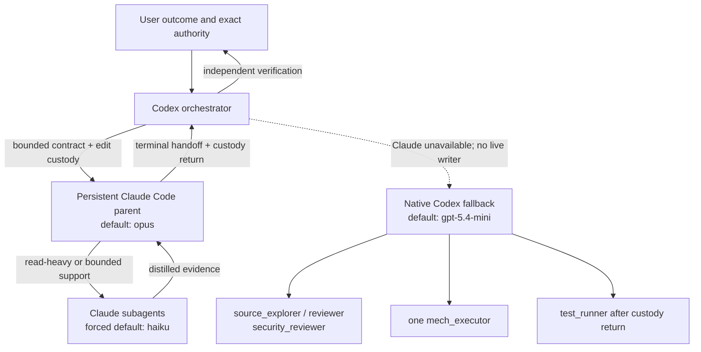

# Codex Claude Orchestrator

[](https://github.com/coredo-eu/codex-claude-orchestrator/actions/workflows/ci.yml)

An installable Codex marketplace plugin for custody-aware, two-level local
delegation:

1. Codex stays the orchestrator and final verifier.
2. A persistent Claude Code parent handles one bounded repository outcome.
3. Claude routes supporting work to a forced-cheap subagent model.
4. If Claude cannot safely continue, Codex transfers the unchanged contract to
   a small set of configurable native fallback roles.

The project is intentionally a transport and policy layer. It is not a daemon,
an agent platform, an operating-system sandbox, or an authority source.



## Why this shape

The economic model is role-based, not a promise about a bill:

- Codex spends its highest-value context on intent, architecture, authority,
  conflicts, and the final verdict.
- One persistent Claude parent amortizes repository context and task setup over
  related follow-ups.
- `CLAUDE_CODE_SUBAGENT_MODEL` forces supporting Claude work onto the configured
  cheaper model instead of silently inheriting the parent.
- Native fallback roles default to a documented smaller Codex model and stay
  narrow.
- Delegation is chosen only when context transfer, coordination, verification,
  and recovery still leave a net cost or elapsed-time benefit.

Parallel agents can consume more tokens than one agent, and model availability
depends on the user's plans and organization policy. This repository therefore
publishes no price table or savings percentage.

## Status and prerequisites

Version `0.1.0` is an early, local-only release.

| Surface | Status |
| --- | --- |
| macOS with Claude Code 2.1.215 | Primary development target |
| Modern Linux with `zsh`, `jq`, Git, `flock`, and `/proc` | Lifecycle tested in CI with fake Claude; real CLI use should be validated locally |
| Windows / PowerShell | Not supported in v0.1 |
| Codex surfaces exporting `CODEX_THREAD_ID` to tool shells | Required |
| Codex surfaces without `CODEX_THREAD_ID` | Unsupported; launcher fails closed |

`CODEX_THREAD_ID` is a compatibility-sensitive host contract, not a stable
public Codex API documented for third-party launchers. Run the preflight after
Codex upgrades and expect this integration point to require maintenance.

Required:

- a supported Codex surface with marketplace plugins and interactive PTYs;
- Claude Code installed and authenticated by the user;
- `zsh`, `jq`, Git, `ps`, `sed`, `awk`, `tr`, and a SHA-256 utility;
- `lockf` on macOS or `flock` on Linux;
- `lsof` on macOS, or `/proc/<pid>/cwd` on Linux, for process-cwd identity;
- access to the configured Claude and Codex models.

The launcher requires these Claude flags: `--model`, `--session-id`, `--resume`,
`--name`, `--settings`, `--setting-sources`, `--strict-mcp-config`,
`--append-system-prompt-file`, and `--disallowedTools`. It never bypasses the
first-launch repository trust dialog; that choice belongs to the user.

Useful preflight from the Codex tool shell:

```zsh
test -n "${CODEX_THREAD_ID:-}" || print -u2 -- "CODEX_THREAD_ID is unavailable"
command -v claude jq zsh git
claude --version
claude --help | rg -- '--model|--settings|--setting-sources|--strict-mcp-config|--session-id|--resume|--disallowedTools'
```

## Install from the Git marketplace

```text
codex plugin marketplace add coredo-eu/codex-claude-orchestrator
codex plugin add codex-claude-orchestrator@codex-claude-orchestrator
```

For a local clone:

```text
codex plugin marketplace add /absolute/path/to/codex-claude-orchestrator
codex plugin add codex-claude-orchestrator@codex-claude-orchestrator
```

Start a new Codex thread after installation so the bundled skill is discovered.
Plugin activation does not edit `AGENTS.md`, native agent configuration, Claude
settings, or authentication.

## Opt in to Claude-first selection

Installing a skill makes the transport available; it does not make a durable
executor-selection policy. Review
[`codex-policy-snippet.md`](plugins/codex-claude-orchestrator/skills/claude-pty-agents/references/codex-policy-snippet.md)
and manually adapt it into the applicable project `AGENTS.md` if you want Codex
to prefer this path. The snippet is generic and cannot weaken stricter project
or organization policy.

Do not automate this copy. `AGENTS.md` may already encode authority and safety
rules that need a human merge.

## Use

Ask Codex to use the bundled skill for a bounded local outcome:

```text
Use $claude-pty-agents to implement this bounded change. Keep Codex as the
authority owner and independently verify Claude's handoff.
```

Codex should provide a compact contract with `Outcome`, observable `Done when`,
`Boundaries`, `Authoritative context`, `Non-goals`, and `Required handoff`. The
skill handles launch/reuse, task transport, terminal handoff, and safe fallback.

Defaults and non-secret overrides:

```zsh
# Defaults shown explicitly; export only when changing them.
export CODEX_CLAUDE_PARENT_MODEL=opus
export CODEX_CLAUDE_SUBAGENT_MODEL=haiku
export CODEX_NATIVE_AGENT_MODEL=gpt-5.4-mini
```

The parent model is passed with `claude --model`. The subagent value is passed
as `CLAUDE_CODE_SUBAGENT_MODEL`, which has higher model-selection precedence
than a subagent definition or per-invocation choice. The worker hook also tells
cheap children not to create another delegation layer.

### Optional native roles

Codex plugins do not install custom Codex agent files on their own. Preview the
bundled templates first:

```zsh
SKILL_DIR=/absolute/path/to/installed/claude-pty-agents
"$SKILL_DIR/scripts/setup-native-agents.zsh" \
  --target project \
  --root /absolute/project/root
```

The default is dry-run. `--apply` asks for confirmation; `--apply --yes` is the
explicit non-interactive form. A pre-existing target, including a dangling
symlink, is refused. Final paths are created atomically without replacement; a
concurrent late collision can leave an earlier role installed, but never
overwrites the colliding entry. Choose `--target user` only when these roles
should be personal defaults across repositories. A model can be selected with
`--model` or `CODEX_NATIVE_AGENT_MODEL`.

The templates are:

- `source_explorer` — read-only source reconstruction;
- `reviewer` — read-only correctness and regression review;
- `security_reviewer` — read-only focused security review;
- `mech_executor` — the sole bounded edit owner after explicit custody transfer;
- `test_runner` — write-capable verification only after edit custody returns or
  in an isolated root.

## Authority and custody boundaries

| Actor | Owns | Must not do without separate authority |
| --- | --- | --- |
| User | Desired outcome and exact authorization | Nothing is inferred from tool availability or old handoffs |
| Codex orchestrator | Architecture, executor choice, authority expansion, conflicts, independent verification, final verdict | Treat a worker handoff as completion or control standalone Claude |
| Codex-owned Claude parent | One bounded local lifecycle in one canonical root | Commit, push, publish, deploy, service control, external messages, host administration, credential operations, destructive remediation, config changes |
| Claude subagent | One cheap supporting package, read-only unless explicitly given a disjoint edit scope | Expand authority, retain edit custody, recursively delegate, write coordination state |
| Native fallback | The same unchanged contract after verified transfer | Overlap a live Claude writer or resume a retired assignment |

One canonical worktree has one edit-capable owner. The launcher creates an
atomic lease keyed by the canonical root and a durable registration bound to a
hash of the current Codex thread. The raw thread identifier is not stored.

A live worker receives a private per-session runtime snapshot with directory
mode `0700` and file modes `0600`/`0700`: generated settings, worker prompt,
subagent hook, model choices, schema version, and runtime version. This prevents
a marketplace update from changing those inputs underneath a live process.
Task bodies are sent through the PTY, never process arguments.

## Disable, fallback, and recovery

The only enabled/disabled state is:

```text
$HOME/.codex/claude-pty-agents.disabled
```

From the installed skill directory:

```zsh
./scripts/toggle-agents.zsh status
./scripts/toggle-agents.zsh off
./scripts/toggle-agents.zsh off --stop
./scripts/toggle-agents.zsh on
```

`off` blocks launch/resume in the runtime and makes a conforming Codex
orchestrator refuse assignments and polls at its next preflight, without killing
a process. That preflight is not atomic with the external PTY call, so a call
already in flight may finish after `off` returns. `off --stop` additionally
sends `TERM` to isolated process groups backed by durable registrations and
verified live leases, then fails closed if a registered group remains.
Standalone Claude is never discovered by name and never targeted.

Native fallback is an ownership transfer:

1. stop input to Claude and obtain a clean terminal handoff;
2. prove the registered process group is empty and edit custody has returned;
3. run `retire-native-fallback.zsh <root> <uuid> <task-id>`;
4. begin native writes only after the retirement marker succeeds.

Retirement holds the global gate, validates thread/root/UUID registration,
checks leases, durable registrations, the process table, and every overlapping
registered process group. A retired UUID cannot be resumed. These are
cooperative controls, not proof against a process deliberately detached from its
group; after a crash, lost PTY, or ambiguous identity, stay read-only or use an
isolated worktree.

## Uninstall and state cleanup

1. Run `off --stop` and verify no registered worker remains.
2. Uninstall the plugin through `/plugins` in Codex CLI or the supported plugin
   UI, then start a new Codex thread.
3. Remove the marketplace only if no other installed plugin depends on it.
4. Native role files are outside plugin lifecycle. Remove only the exact files
   you previously installed, and only after reviewing that they were not edited.
5. Inspect `$HOME/.codex/claude-pty-sessions` and
   `$HOME/.codex/claude-pty-leases` before deleting any retired/stale state. Do
   not use a broad recursive deletion against `$HOME` or `$HOME/.codex`.

The runtime stores registrations, leases, model names, generated settings, and
retirement metadata in the user's Codex state directory. Claude Code may store
its own transcripts, history, and diagnostics according to its product
behavior. This plugin does not upload that data or print task bodies itself, but
it is not a log-prevention or data-loss-prevention system.

## Threat model

Designed to resist accidental overlap and common authority drift:

- canonical-root leases prevent two registered writers in overlapping scopes;
- current-thread registration prevents UUID-only resume;
- retirement makes native transfer non-resumable and fails closed on a live
  process;
- a global gate serializes launch, disable, and retirement state transitions;
- generated settings deny common configuration edits and the CLI denies common
  external, destructive, publication, and service-control commands;
- setting sources are empty and no MCP servers are enabled for the worker;
- runtime snapshots are private to the local user and contain no task body or
  credential by design.

Not defended as an OS security boundary:

- a malicious or compromised repository, shell tool, hook, Claude/Codex binary,
  dependency, or same-user process;
- Bash variants that evade string-based deny rules;
- network egress allowed by the host sandbox;
- credentials already present in inherited environment variables or readable
  files;
- tampering by another process running as the same OS user;
- PID/cwd inspection unavailable on an unsupported platform;
- product changes to undocumented `CODEX_THREAD_ID` behavior.

Use only trusted repositories, run Codex with least-privilege sandbox and
network policy, keep secrets out of task contracts, and review generated runtime
state before sharing diagnostics. The first Claude trust dialog and any later
approval remain user decisions; the launcher does not answer them.

## Verification

The self-check uses a clean temporary home and fake Claude process. It verifies
manifest structure, shell syntax, model separation, snapshot permissions,
clean-profile argv/environment, concurrent writer rejection, fail-closed live
retirement, retired resume rejection, kill-switch behavior, native installer
safety, and absence of private paths or credential-shaped data.

```zsh
./scripts/self-check.zsh
```

GitHub Actions runs the same checks without Claude/Codex credentials or network
calls to either product.

## Official documentation

- [Codex plugins](https://learn.chatgpt.com/docs/plugins)
- [Codex custom subagents and agent files](https://learn.chatgpt.com/docs/agent-configuration/subagents#custom-agents)
- [Claude Code CLI reference](https://code.claude.com/docs/en/cli-reference)
- [Claude Code subagents and model precedence](https://code.claude.com/docs/en/sub-agents)
- [Claude Code hooks](https://code.claude.com/docs/en/hooks)

## License

MIT. See [LICENSE](LICENSE).

This is an independent project and is not affiliated with or endorsed by OpenAI
or Anthropic. Codex, Claude, and Claude Code are trademarks of their respective
owners.
