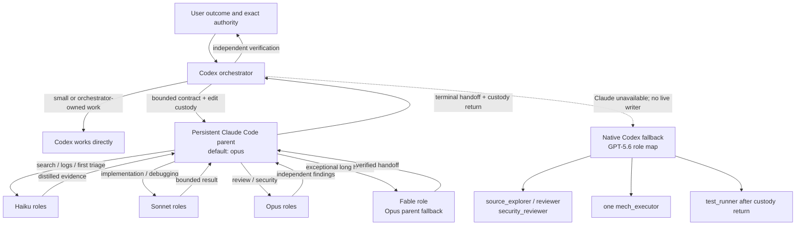

# Codex Claude Orchestrator

[](https://github.com/coredo-eu/codex-claude-orchestrator/actions/workflows/ci.yml)

> [!IMPORTANT]
> **Branch variant — `codeindexer`.** This long-lived variant gives the
> orchestrator guarded, read-only access to
> [CodeIndexer](https://codeindexer.dev), a local MCP code-intelligence service
> for semantic and symbolic search, call-graph navigation, change-impact
> analysis, and persistent agent memory. Use it when a large or multi-repository
> codebase makes repeated text search and context rebuilding expensive. New
> workers require an exact credential-free loopback `codeindexer` HTTP `/mcp`
> entry in `~/.claude.json`; the launcher snapshots only that endpoint and
> exposes an allowlisted read surface. Indexed findings still require source
> verification. For no MCP dependency, use the separate
> [`main`](https://github.com/coredo-eu/codex-claude-orchestrator/tree/main)
> variant. The branches are alternatives and are not intended to be merged.

Use Codex and Claude Code as one local engineering system instead of choosing
between them. Codex keeps user intent, architecture, executor choice, and the
final verdict. A persistent Claude Code parent retains execution context and
routes bounded work to Haiku, Sonnet, Opus, or Fable. Native GPT-5.6 roles are
available as an explicit fallback after Claude returns custody.

The project is an installable Codex marketplace plugin. It is intentionally a
transport and policy layer: no hosted coordinator, no credential relay, no
daemon, and no claim to be an operating-system sandbox.

## TL;DR

- **Codex remains in charge.** It decides whether delegation is worthwhile and
  independently verifies the result. Claude is not forced onto every action.
- **Claude keeps context.** One PTY-backed Opus parent can survive across related
  tasks instead of rebuilding repository and outcome context every time.
- **CodeIndexer stays optional.** The parent gets credential-free loopback,
  read-only semantic discovery while direct source tools remain equally valid.
- **Each model gets the work it fits.** Haiku searches and triages, Sonnet
  implements and debugs, Opus reviews and synthesizes, and Fable is reserved for
  exceptional long-horizon work.
- **Native Codex roles are explicit.** GPT-5.6 Luna, Terra, and Sol are mapped to
  discovery, verification, implementation, review, and security rather than
  silently inheriting the main session model.
- **The whole loop stays local.** The plugin launches the user's authenticated
  Claude Code CLI and stores private runtime snapshots under Codex state.
- **It is subscription-first.** Users whose ChatGPT and Claude plans include
  their respective coding clients can use both official subscriptions without
  turning this plugin into an API-key broker.



## Why use it

- **Better allocation of expensive reasoning.** Strong models spend more time
  on intent, synthesis, difficult implementation, and review instead of routine
  file search or log classification.
- **Less repeated setup.** The Opus parent retains repository and task context,
  so related follow-ups do not each pay the full cold-start cost.
- **Higher throughput when work separates cleanly.** Independent discovery,
  triage, implementation, and review packages can use different contexts and
  models while Codex keeps one final decision point.
- **Quality through separation of responsibility.** The worker produces the
  result and evidence; Codex treats that handoff as a claim to verify, not as
  automatic completion.
- **Predictable model routing.** The roster is pinned in a private runtime
  snapshot. Hidden environment overrides are cleared so a cheap or expensive
  global default cannot silently collapse every role onto one model.
- **Lower approval-loop latency.** New Claude PTY parents start in Auto Mode.
  Product safety classification and the launcher's deny rules still apply, but
  routine work no longer waits behind a manual permission queue.
- **Graceful failure.** A kill switch stops new assignments. Native fallback is
  possible only after Codex proves the Claude writer is gone and custody has
  returned.
- **Inspectable local mechanics.** Leases, registrations, prompts, hooks, model
  maps, and recovery rules live in this repository and local runtime state.

These are design benefits, not guaranteed savings. Parallel agents can consume
more total tokens, delegation has coordination overhead, and a one-line edit may
be faster in the main Codex session.

## Two subscriptions, one local workflow

One practical reason to use this project is capacity. If the included usage of
one coding subscription is not enough, but you do not want to rely on multiple
accounts with the same provider, you can combine two independent first-party
subscriptions instead: one OpenAI account with ChatGPT Plus and one Anthropic
account with Claude Pro.

At the currently published US monthly prices, ChatGPT Plus is **$20/month** and
includes Codex in the CLI, while Claude Pro is **$20/month** and includes Claude
Code. The orchestrator turns that `$20 + $20` combination into one local
workflow, with capacity coming from two official products rather than duplicate
accounts inside one service. Prices exclude taxes, optional credits, and
higher-capacity plans:

- [OpenAI Codex pricing and plan availability](https://learn.chatgpt.com/docs/pricing)
- [Anthropic Claude pricing and Claude Code availability](https://claude.com/pricing)

Each subscription remains separate and authenticates through its provider's
official client. The plugin coordinates Codex and Claude Code locally; it does
not copy cookies, forward login credentials, share accounts, convert a consumer
subscription into an unofficial API, or bypass provider limits. Prices,
availability, model access, and usage limits can change and vary by region or
organization. This is not a legal or terms-of-service guarantee; users remain
responsible for the rules that apply to their accounts. Claude Code also chooses
its billing path from its active authentication; an inherited API key can select
API billing instead of subscription usage. Check the active account and billing
source in both CLIs before relying on included plan usage.

## How a task moves through the system

1. **The user gives Codex an outcome.** Existing repository instructions and
   exact authorization still apply.
2. **Codex chooses the executor.** It works directly when delegation overhead
   would dominate, and chooses Claude only when persistence, specialization, or
   parallelism should improve total cost or elapsed time without weakening the
   result.
3. **Codex creates a bounded contract.** The handoff states the outcome, an
   observable `Done when`, boundaries, authoritative context, non-goals, and the
   evidence required back.
4. **The plugin launches or reuses one worker.** Its registration is bound to
   the current Codex thread and canonical repository root. A lease prevents a
   second registered writer in an overlapping worktree.
5. **The Opus parent owns execution.** It receives the task body through the PTY,
   never as a process argument, and chooses its own method.
6. **Claude routes supporting packages.** Search and triage go to Haiku,
   implementation and debugging to Sonnet, difficult review to Opus, and only
   exceptional long-horizon work to Fable.
7. **The worker returns a compact handoff.** It reports changed artifacts,
   decisive evidence, remaining uncertainty, deliberate non-actions, and edit
   custody.
8. **Codex independently verifies.** The orchestrator decides whether the real
   user outcome is complete and expands verification only while a material
   uncertainty remains.
9. **Fallback is an explicit transfer.** If Claude cannot continue, native Codex
   work starts only after the registered Claude process is gone and its UUID is
   retired against native fallback.

### Codex does not send every action to Claude

The opt-in policy is an executor-selection objective, not an unconditional
hook. Codex keeps routine direct work when launching or briefing a worker would
cost more than doing the task. Codex also retains user intent, material product
or architecture tradeoffs, authority expansion, conflict resolution,
independent verification, and the final verdict. Auto Mode changes how an
already selected Claude worker handles permissions; it does not change who
selects the worker.

## Agent and model map

### Control plane

| Actor | Model | Responsibility |
| --- | --- | --- |
| Codex orchestrator | Main session model; never pinned by this plugin | Intent, architecture, executor choice, authority, independent verification, final verdict |
| Claude parent | Opus by default | Persistent execution context, decomposition, routing, synthesis, worker handoff |

### Claude execution roles

| Claude role | Model | Intended work |
| --- | --- | --- |
| `explorer` | Haiku | file search, source facts, bounded discovery |
| `log-analyzer` | Haiku | logs, test output, classification |
| `test-triager` | Haiku | first pass over failures |
| `implementer` | Sonnet | ordinary bounded implementation |
| `debugger` | Sonnet | multi-step diagnosis without intended source edits |
| `reviewer` | Opus | complex regressions and architecture review |
| `security-reviewer` | Opus | security, authorization, privacy, and concurrency |
| `long-horizon` | Fable | exceptionally large autonomous outcomes only |

### Optional native Codex fallback roles

| Native role | Model | Reasoning effort | Intended work |
| --- | --- | --- | --- |
| `source_explorer` | `gpt-5.6-luna` | `medium` | direct read-only source discovery |
| `test_runner` | `gpt-5.6-luna` | `low` | bounded verification after edit custody returns |
| `mech_executor` | `gpt-5.6-terra` | `medium` | sole owner of one bounded implementation |
| `reviewer` | `gpt-5.6-terra` | `high` | correctness, regression, and evidence review |
| `security_reviewer` | `gpt-5.6-sol` | `high` | focused security, privacy, credential, and authorization review |

Native routing is explicit: `task_name` names a semantic task instance only;
`agent_type` selects the installed custom profile. For example, use
`task_name=authz_source_discovery`, `agent_type=source_explorer`, and
`fork_turns=none`. The native receipt must return the same non-empty
`agent_role` (`source_explorer` in this example) before assigning work or
transferring custody. Missing or mismatched `agent_role` fails closed. Do not
encode a role in `task_name`, omit `agent_type`, or use Claude's
`subagent_type` field for native routing.

With an explicit `agent_type`, `fork_turns=all` and the default are invalid;
use `none` or a bounded numeric value. An omitted `agent_type` selects the
platform default rather than a custom profile. Sandbox inheritance is a
separate runtime limitation, not a configuration-routing fix.

## A concrete example

Suppose the user asks Codex to fix an intermittent authorization regression:

1. Codex determines that the task is bounded but benefits from persistent
   execution context, then transfers one explicit edit scope to Claude.
2. The Opus parent asks `explorer` on Haiku to map the relevant code and
   `test-triager` on Haiku to classify the failure evidence.
3. `debugger` on Sonnet establishes the likely cause without editing source.
4. `implementer` on Sonnet receives sole edit custody and makes the bounded
   change.
5. The Opus parent may route a focused regression review to `reviewer`, or a
   security-sensitive boundary to `security-reviewer`.
6. Claude returns evidence and custody. Codex inspects the real diff and tests,
   resolves any material uncertainty, and gives the user the final verdict.

The exact decomposition is not hard-coded. The prompts state the outcome and
boundaries, then let the models choose the method. A simpler task may stay
entirely in Codex or use only the Claude parent.

## Good fit and poor fit

| Good fit | Poor fit |
| --- | --- |
| You already use both Codex and Claude Code | You want every one-line edit delegated automatically |
| Multi-step repository work benefits from retained context | You need an unattended CI runner rather than an interactive PTY |
| Search, implementation, and review can be separated cleanly | You require an OS-grade sandbox for an untrusted repository |
| You want explicit model routing and independent final verification | You need Windows support today |
| You value local, inspectable orchestration over a hosted agent service | Your Codex surface does not expose `CODEX_THREAD_ID` |

## Prompt design

The model prompts state the outcome, authority boundary, and evidence expected
at handoff, then explicitly leave method, decomposition, investigation, and
verification choices to the model. Routing descriptions explain when a role is
useful; tool allowlists and runtime controls enforce capabilities. Prompts do
not duplicate those mechanisms with a hand-written implementation plan.

This follows current guidance to keep strong-model prompts lean and
outcome-focused. Prescriptive steps remain appropriate only when order itself
is a real safety or protocol requirement. The self-check enforces compact
`Outcome` / `Boundary` / `Return` contracts so future edits do not quietly
restore procedural scaffolding.

## Status and prerequisites

Version `0.3.1` is an early, local-execution release.

"Local execution" describes the orchestration, processes, repository access,
leases, and custody state. Model requests and supplied content are still handled
by OpenAI and Anthropic according to the user's product, account, and data
settings.

| Surface | Status |
| --- | --- |
| macOS with Claude Code 2.1.215 | Primary development target |
| Modern Linux with `zsh`, `jq`, Git, `flock`, and `/proc` | Lifecycle tested in CI with fake Claude; real CLI use should be validated locally |
| Windows / PowerShell | Not supported in v0.2 |
| Claude Auto Mode | Requires a supported Claude Code version, provider/model, and any applicable organization enablement |
| Codex surfaces exporting `CODEX_THREAD_ID` to tool shells | Required |
| Codex surfaces without `CODEX_THREAD_ID` | Unsupported; launcher fails closed |

`CODEX_THREAD_ID` is a compatibility-sensitive host contract, not a stable
public Codex API documented for third-party launchers. Run the preflight after
Codex upgrades and expect this integration point to require maintenance.

Required:

- a supported Codex surface with marketplace plugins and interactive PTYs;
- Claude Code installed and authenticated by the user;
- `zsh`, `jq`, Git, `ps`, `sed`, `awk`, `tr`, and a SHA-256 utility;
- `lockf` on macOS or `flock` on Linux;
- `lsof` on macOS, or `/proc/<pid>/cwd` on Linux, for process-cwd identity;
- access to the configured Claude and Codex models.

The launcher requires these Claude flags: `--model`, `--agents`, `--session-id`,
`--resume`, `--name`, `--settings`, `--setting-sources`, `--strict-mcp-config`,
`--append-system-prompt-file`, and `--disallowedTools`. It never bypasses the
first-launch repository trust dialog; that choice belongs to the user.

Useful preflight from the Codex tool shell:

```zsh
test -n "${CODEX_THREAD_ID:-}" || print -u2 -- "CODEX_THREAD_ID is unavailable"
command -v claude jq zsh git
claude --version
claude --help | rg -- '--agents|--model|--settings|--setting-sources|--strict-mcp-config|--session-id|--resume|--disallowedTools'
```

## Install from the Git marketplace

```text
codex plugin marketplace add coredo-eu/codex-claude-orchestrator
codex plugin add codex-claude-orchestrator@codex-claude-orchestrator
```

For a local clone:

```text
codex plugin marketplace add /absolute/path/to/codex-claude-orchestrator
codex plugin add codex-claude-orchestrator@codex-claude-orchestrator
```

Start a new Codex thread after installation so the bundled skill is discovered.
Plugin activation does not edit `AGENTS.md`, native agent configuration, Claude
settings, or authentication.

## Opt in to Claude-first selection

Installing a skill makes the transport available; it does not make a durable
executor-selection policy. Review
[`codex-policy-snippet.md`](plugins/codex-claude-orchestrator/skills/claude-pty-agents/references/codex-policy-snippet.md)
and manually adapt it into the applicable project `AGENTS.md` if you want Codex
to prefer this path. The snippet is generic and cannot weaken stricter project
or organization policy.

Do not automate this copy. `AGENTS.md` may already encode authority and safety
rules that need a human merge.

## Use

Ask Codex to use the bundled skill for a bounded local outcome:

```text
Use $codex-claude-orchestrator:claude-pty-agents to implement this bounded
change. Keep Codex as the authority owner and independently verify Claude's
handoff.
```

Codex should provide a compact contract with `Outcome`, observable `Done when`,
`Boundaries`, `Authoritative context`, `Non-goals`, and `Required handoff`. The
skill handles launch/reuse, task transport, terminal handoff, and safe fallback.

Parent default and non-secret override:

```zsh
# Defaults shown explicitly; export only when changing them.
export CODEX_CLAUDE_PARENT_MODEL=opus
```

The parent model is passed with `claude --model`. The role roster is passed with
`--agents` from a private runtime snapshot. A `PreToolUse` hook rejects unlisted
roles and mismatched per-invocation model overrides. The launcher also clears
inherited `CLAUDE_CODE_SUBAGENT_MODEL` and legacy
`CODEX_CLAUDE_SUBAGENT_MODEL` values because Claude gives a global override
higher precedence than per-role definitions. The worker hook prevents another
delegation layer.

### Claude routing details

Claude Code inherits the Opus parent when Fable is outside the account's
allowed model set. If Fable fails for another availability reason, the parent
retains the outcome instead of silently routing it to a cheaper role. The
roster deliberately denies built-in Explore, Plan, general-purpose,
statusline-setup, and claude-code-guide agents. A runtime hook rejects unlisted
roles and any per-invocation model override that disagrees with the published
map.

The generated worker settings set `permissions.defaultMode` to `auto`. Current
Claude Code behavior makes subagents inherit parent Auto Mode and ignore their
per-role `permissionMode`, including the roster's declared `plan` value. Roles
described as read-only therefore omit Edit and Write and carry an explicit
read-only contract, but their Bash access remains a cooperative boundary rather
than an OS-enforced no-write sandbox. Auto Mode reduces permission-queue latency;
it does not expand the task's authority or bypass the launcher's deny rules.
Classifier calls count toward Claude usage and can add a round trip for shell,
network, and other non-routine actions; ordinary reads and in-worktree edits are
handled without that classifier call under current Claude Code behavior.

### Persistent-parent context

Claude Code remains the sole owner of context compaction. Runtime-schema-3/4
workers use a `PostCompact` observer that appends one literal event marker and
drains the hook payload without parsing, printing, or retaining
`compact_summary`.

Before a new assignment, Codex runs:

```zsh
"$SKILL_DIR/scripts/assign-worker.zsh" <root> <uuid> <task-id>
```

Two completed compactions are the decision threshold. At the threshold or after
any later unreviewed compaction, the normal path exits `76`. Codex may
rotate or rerun with `--continue-current-context`. That acknowledgement covers
the current compaction count, so related assignments remain convenient until
another compaction creates a new decision point. Schema-1/2 sessions have no
observer; they remain usable but are reported as `unobserved_legacy`, never as
fresh context.

Rotation is optional, not counter-driven. It succeeds only after Codex attests a
terminal handoff and custody return and the runtime finds no live overlapping
lease, process group, or exact worker process. The retirement record makes the
old UUID non-resumable. `launch-worker.zsh --successor-of <uuid>` records each
registered attempt by storing the predecessor and rotation lineage in the new
registration. A failed attempt does not reserve the lineage or prevent a retry.

The durable context state is an append-only event log, the last acknowledged
count, and a content-free pending marker left only when an event append cannot
complete. It contains no prompt, assignment body, transcript, generated
summary, or subagent return. Like the
existing kill switch and leases, the assignment gate is cooperative same-UID
accounting; it is not a sandbox against a compromised worker.

### CodeIndexer profile

[CodeIndexer](https://codeindexer.dev) builds a local, queryable view of project
structure for semantic and symbolic search, call-graph navigation, change-impact
analysis, and persistent agent memory. This variant is intended for large or
multi-repository systems where those derived views can reduce repeated file
search and context rebuilding.

New schema-4 workers read only the `codeindexer` entry from `$HOME/.claude.json`
and accept an exact credential-free `http` loopback `/mcp` URL. The minimal
config is copied into the private session snapshot; resume never rereads the
global file. A `PreToolUse` guard allows a small semantic read surface and
denies mutation, unknown tools, and unknown actions. The index does not replace
direct inspection: material findings still require verification in
authoritative source. The MCP-free `main` runtime stops at schema 3, preventing
silent cross-profile resume.

### Optional native roles

Codex plugins do not install custom Codex agent files on their own. Preview the
bundled templates first:

```zsh
SKILL_DIR=/absolute/path/to/installed/claude-pty-agents
"$SKILL_DIR/scripts/setup-native-agents.zsh" \
  --target project \
  --root /absolute/project/root
```

The default is dry-run. `--apply` asks for confirmation; `--apply --yes` is the
explicit non-interactive form. A pre-existing target, including a dangling
symlink, is refused. Final paths are created atomically without replacement; a
concurrent late collision can leave an earlier role installed, but never
overwrites the colliding entry. Choose `--target user` only when these roles
should be personal defaults across repositories. A uniform model can be
selected with `--model` or `CODEX_NATIVE_AGENT_MODEL`. A repeatable
`--role-model role=model` overrides one role and takes precedence over a
uniform override.

The templates are:

- `source_explorer` — read-only source reconstruction;
- `reviewer` — read-only correctness and regression review;
- `security_reviewer` — read-only focused security review;
- `mech_executor` — the sole bounded edit owner after explicit custody transfer;
- `test_runner` — write-capable verification only after edit custody returns or
  in an isolated root.

The default model and effort map is listed in
[Agent and model map](#agent-and-model-map). The Codex orchestrator inherits the
model of the main Codex session; this plugin never pins it.

## Authority and custody boundaries

| Actor | Owns | Must not do without separate authority |
| --- | --- | --- |
| User | Desired outcome and exact authorization | Nothing is inferred from tool availability or old handoffs |
| Codex orchestrator | Material architecture or product tradeoffs, executor choice, authority expansion, conflicts, independent verification, final verdict | Treat a worker handoff as completion or control standalone Claude |
| Codex-owned Claude parent | One bounded local lifecycle in one canonical root | Commit, push, publish, deploy, service control, external messages, host administration, credential operations, destructive remediation, config changes |
| Claude subagent | One role-specific supporting package; only implementer or long-horizon can receive edit custody | Expand authority, overlap another writer, recursively delegate, write coordination state |
| Native fallback | The same unchanged contract after verified transfer | Overlap a live Claude writer or resume a retired assignment |

One canonical worktree has one edit-capable owner. The launcher creates an
atomic lease keyed by the canonical root and a durable registration bound to a
hash of the current Codex thread. The raw thread identifier is not stored.

A live worker receives a private per-session runtime snapshot with directory
mode `0700` and file modes `0600`/`0700`: generated settings, worker prompt,
subagent context hook, agent-routing hook, exact roster, model choices, schema
version, and runtime version. This prevents a marketplace update from changing
those inputs underneath a live process.
Task bodies are sent through the PTY, never process arguments.
The `--agents` process argument contains only the static roster policy, never a
task body, repository path, thread identifier, or credential.

## Disable, fallback, and recovery

The only enabled/disabled state is:

```text
$HOME/.codex/claude-pty-agents.disabled
```

From the installed skill directory:

```zsh
./scripts/toggle-agents.zsh status
./scripts/toggle-agents.zsh off
./scripts/toggle-agents.zsh off --stop
./scripts/toggle-agents.zsh on
```

`off` blocks launch/resume in the runtime and makes a conforming Codex
orchestrator refuse assignments and polls at its next preflight, without killing
a process. That preflight is not atomic with the external PTY call, so a call
already in flight may finish after `off` returns. `off --stop` additionally
sends `TERM` to isolated process groups backed by durable registrations and
verified live leases, then fails closed if a registered group remains.
Standalone Claude is never discovered by name and never targeted.

Native fallback is an ownership transfer:

1. stop input to Claude and obtain a clean terminal handoff;
2. prove the registered process group is empty and edit custody has returned;
3. run `retire-native-fallback.zsh <root> <uuid> <task-id>`;
4. begin native writes only after the retirement marker succeeds.

Retirement holds the global gate, validates thread/root/UUID registration,
checks leases, durable registrations, the process table, and every overlapping
registered process group. A retired UUID cannot be resumed. These are
cooperative controls, not proof against a process deliberately detached from its
group; after a crash, lost PTY, or ambiguous identity, stay read-only or use an
isolated worktree.

Version `0.3.1` adds schema 4 for the pinned read-only CodeIndexer profile on top
of schema 3's content-free compaction observer and assignment checkpoint.
Schema-3 resumes remain MCP-free and reuse their original snapshots. Schema-2
and schema-1 resumes likewise keep their original roster/model behavior and
report context as `unobserved_legacy`; none is silently converted. Unversioned
legacy registrations are not adopted.

## Uninstall and state cleanup

1. Run `off --stop` and verify no registered worker remains.
2. Uninstall the plugin through `/plugins` in Codex CLI or the supported plugin
   UI, then start a new Codex thread.
3. Remove the marketplace only if no other installed plugin depends on it.
4. Native role files are outside plugin lifecycle. Remove only the exact files
   you previously installed, and only after reviewing that they were not edited.
5. Inspect `$HOME/.codex/claude-pty-sessions` and
   `$HOME/.codex/claude-pty-leases` before deleting any retired/stale state. Do
   not use a broad recursive deletion against `$HOME` or `$HOME/.codex`.

The runtime stores registrations, leases, model names, generated settings, the
credential-free loopback CodeIndexer URL, and retirement metadata in the user's
Codex state directory. Claude Code may store
its own transcripts, history, and diagnostics according to its product
behavior. This plugin does not upload that data or print task bodies itself, but
it is not a log-prevention or data-loss-prevention system.

## Threat model

Designed to resist accidental overlap and common authority drift:

- canonical-root leases prevent two registered writers in overlapping scopes;
- current-thread registration prevents UUID-only resume;
- retirement makes native transfer non-resumable and fails closed on a live
  process;
- a global gate serializes launch, disable, and retirement state transitions;
- generated settings deny common configuration edits and the CLI denies common
  external, destructive, publication, and service-control commands;
- setting sources are empty; schema 4 enables only the pinned, guarded,
  credential-free loopback CodeIndexer snapshot, while schema 1–3 remain
  MCP-free;
- inherited global subagent-model overrides are removed for schema-2+ workers;
- built-in Claude agents are denied, and a pre-spawn hook rejects unlisted
  roles or mismatched model overrides;
- runtime snapshots are private to the local user and contain no task body or
  credential by design.

Not defended as an OS security boundary:

- a malicious or compromised repository, shell tool, hook, Claude/Codex binary,
  dependency, or same-user process;
- Bash variants that evade string-based deny rules;
- non-edit roles retain Bash, and parent Auto Mode takes precedence over their
  declared `plan` value; their read-only behavior is cooperative rather than an
  OS-enforced filesystem boundary;
- per-role routing is enforced by a same-user hook, not an OS or account-level
  boundary;
- network egress allowed by the host sandbox;
- credentials already present in inherited environment variables or readable
  files;
- tampering by another process running as the same OS user;
- PID/cwd inspection unavailable on an unsupported platform;
- product changes to undocumented `CODEX_THREAD_ID` behavior.

Use only trusted repositories, run Codex with least-privilege sandbox and
network policy, keep secrets out of task contracts, and review generated runtime
state before sharing diagnostics. The first Claude trust dialog and any prompt
that Auto Mode still surfaces remain user decisions; the launcher never types an
approval response.

## Verification

The self-check uses a clean temporary home and fake Claude process. It verifies
manifest structure, shell syntax, exact role routing, snapshot permissions,
clean-profile argv/environment, concurrent writer rejection, fail-closed live
retirement, retired resume rejection, kill-switch behavior, native installer
safety, and absence of private paths or credential-shaped data.

```zsh
./scripts/self-check.zsh
```

GitHub Actions runs the same checks without Claude/Codex credentials or network
calls to either product.

## Official documentation

- [Codex plugins](https://learn.chatgpt.com/docs/plugins)
- [Codex plan pricing and availability](https://learn.chatgpt.com/docs/pricing)
- [Codex custom subagents and agent files](https://learn.chatgpt.com/docs/agent-configuration/subagents#custom-agents)
- [OpenAI GPT-5.6 prompting best practices](https://developers.openai.com/api/docs/guides/latest-model#prompting-best-practices)
- [Claude Code CLI reference](https://code.claude.com/docs/en/cli-reference)
- [Claude plan pricing and Claude Code availability](https://claude.com/pricing)
- [Using Claude Code with a Claude subscription](https://support.claude.com/en/articles/11145838-use-claude-code-with-your-pro-or-max-plan)
- [Claude Code permission modes](https://code.claude.com/docs/en/permission-modes)
- [Claude Code subagents and model precedence](https://code.claude.com/docs/en/sub-agents)
- [Claude Code hooks](https://code.claude.com/docs/en/hooks)
- [Anthropic prompting best practices](https://platform.claude.com/docs/en/build-with-claude/prompt-engineering/claude-prompting-best-practices)
- [Anthropic prompting Claude Fable 5](https://platform.claude.com/docs/en/build-with-claude/prompt-engineering/prompting-claude-fable-5)

## License

MIT. See [LICENSE](LICENSE).

This is an independent project and is not affiliated with or endorsed by OpenAI
or Anthropic. Codex, Claude, and Claude Code are trademarks of their respective
owners.
